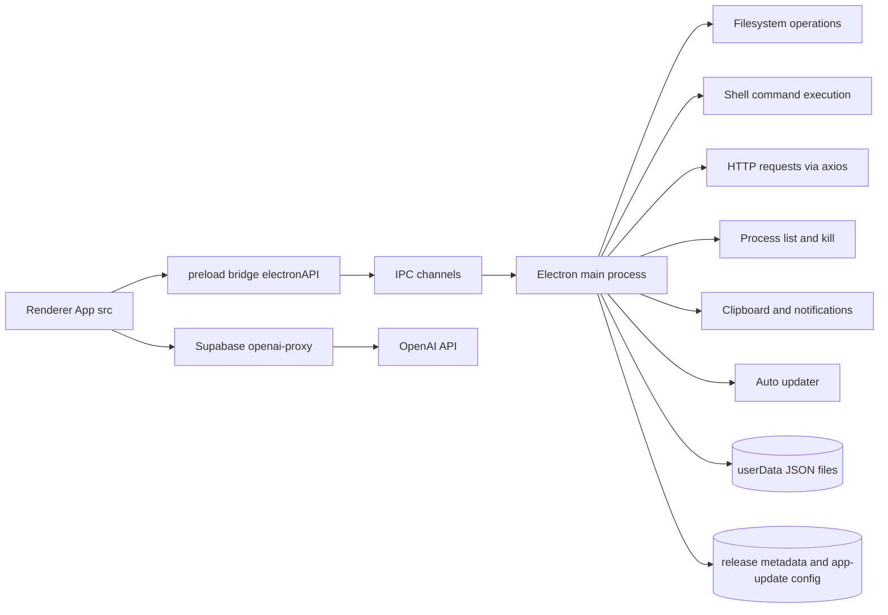

# Theta Desktop Comprehensive Audit Report

Date: 2026-04-12
Project: Theta Desktop (Electron + React + TypeScript + Vite)
Audit type: Static code and configuration audit (source, build, updater, dependency, and security posture)

## 1) Executive Summary

Overall risk rating: Critical

Key conclusions:

- The renderer process is over-privileged and runs with unsafe web settings, creating a high-probability XSS-to-RCE path.
- Update trust protections are explicitly disabled in multiple places, weakening supply-chain security.
- The IPC and AI tool execution layer exposes powerful system actions (shell, filesystem, process kill, network) with broad input trust.
- Secrets are stored in plain JSON under userData without OS-level credential storage.
- Dependency posture includes active critical/high vulnerabilities.

Vulnerability snapshot (npm audit, local run):

- Production only: total 6, critical 1, high 4, moderate 1, low 0
- Full (prod + dev): total 24, critical 1, high 19, moderate 2, low 2

## 2) Scope And Method

Reviewed areas:

- Electron main and preload process security
- Renderer tool-calling and privileged bridge usage
- Build and update pipeline configuration
- Supabase edge proxy function security posture
- Dependency vulnerabilities and version drift

Evidence method:

- Line-level source inspection
- Config artifact inspection (build and release metadata)
- Local dependency audit and outdated package analysis

## 3) Architecture Overview

## 4) Severity-Ranked Findings

### C-01: Renderer Hardening Disabled (XSS to RCE Exposure)

Severity: Critical

Evidence:

- electron/main.js:82 -> nodeIntegration: true
- electron/main.js:86 -> webSecurity: false
- electron/main.js:87 -> allowRunningInsecureContent: true

Why this matters:

- Combining nodeIntegration with relaxed web security significantly increases the blast radius of any injected script or untrusted web content.

Recommended fix:

- Set nodeIntegration to false.
- Keep contextIsolation true.
- Set webSecurity true and allowRunningInsecureContent false.
- Move required privileged behavior behind explicit, minimal IPC APIs.

### C-02: Update Signature Verification Disabled

Severity: Critical

Evidence:

- electron/main.js:30 -> autoUpdater.verifySourceSignature = false
- electron/main.js:31 -> autoUpdater.verifyUpdaterSignature = false
- electron-builder.yml:18 -> verifyUpdateCodeSignature: false

Why this matters:

- Disabling signature verification weakens authenticity guarantees for updates.

Recommended fix:

- Re-enable source/updater signature verification in runtime and build config.
- Enforce signed artifacts in release pipeline and fail CI on unsigned publish.

### H-01: High-Risk IPC Surface Without Strong Policy Guards

Severity: High

Evidence:

- electron/main.js:456 -> system-fs-op
- electron/main.js:476 -> system-exec-command
- electron/main.js:598 -> http-fetch
- electron/main.js:667 -> kill-process

Why this matters:

- These handlers expose destructive capabilities and can be abused if any renderer compromise occurs.

Recommended fix:

- Introduce strict IPC allowlists and schema validation (zod or equivalent).
- Add operation-level authorization checks and path restrictions.
- Block dangerous shell patterns and remove direct raw command execution where possible.

### H-02: Generic Preload Bridge Permits Broad Channel Invocation

Severity: High

Evidence:

- electron/preload.js:9 -> invoke(channel, ...args)
- electron/preload.js:10 -> on(channel, callback)

Why this matters:

- A generic bridge increases chance of unauthorized access to privileged channels from renderer code.

Recommended fix:

- Replace generic invoke/on with named, typed methods only.
- Expose only minimum channels needed by the UI.

### H-03: AI System Instruction And Tooling Encourage Risky Automation

Severity: High

Evidence:

- src/config/gemini-config.ts:7 -> execute_shell_command tool description
- src/config/gemini-config.ts:312 -> "You NEVER say ..."
- src/config/gemini-config.ts:317 -> "FALLBACK TO SHELL"
- src/lib/gemini-tool-runner.ts:404 -> execute_shell_command dispatch
- src/lib/gemini-tool-runner.ts:416 -> manage_files dispatch
- src/lib/gemini-tool-runner.ts:513 -> http_request dispatch
- src/lib/gemini-tool-runner.ts:544 -> kill_process dispatch

Why this matters:

- Prompt policy plus direct execution pathways can reduce practical safety margins under prompt injection or misalignment.

Recommended fix:

- Add mandatory runtime policy gates independent of model output.
- Require explicit user confirmation for shell/file/process/network actions.
- Add denylist and sandbox controls for command execution.

### H-04: Supabase Proxy CORS Is Wildcard And Lacks Requester Auth Gate

Severity: High

Evidence:

- supabase/functions/openai-proxy/index.ts:9 -> Access-Control-Allow-Origin: \*
- supabase/functions/openai-proxy/index.ts:17 -> OPTIONS allowed broadly
- supabase/functions/openai-proxy/index.ts:35 -> server-side Authorization to OpenAI

Why this matters:

- Open CORS and missing caller authentication can permit unauthorized use and key abuse.

Recommended fix:

- Restrict CORS to trusted origins.
- Enforce authentication (JWT or signed app token) before proxying.
- Add rate limiting and request budget controls.

### H-05: API Key Stored In Plain JSON Under userData

Severity: High

Evidence:

- electron/main.js:219 -> secret_key.json path in userData
- electron/main.js:433 -> get-gemini-token
- electron/main.js:446 -> save-gemini-token
- electron/main.js:448 -> fs.writeFileSync secret key payload

Why this matters:

- Plaintext secret storage is vulnerable to local compromise, malware, and accidental backup leakage.

Recommended fix:

- Move secrets to OS credential vault (Windows Credential Manager, Keychain, libsecret).
- Keep only non-sensitive metadata in local files.

### M-01: Overly Permissive CSP And CSP Removal For file://

Severity: Medium

Evidence:

- electron/main.js:934 -> wildcard CSP with unsafe-inline and unsafe-eval
- electron/main.js:951 -> delete Content-Security-Policy
- electron/main.js:952 -> delete content-security-policy

Why this matters:

- CSP defenses are weakened and in some paths removed.

Recommended fix:

- Adopt restrictive CSP with nonce/hash-based script allowances.
- Avoid global wildcard sources and avoid removing CSP headers.

### M-02: Permission Grant Logic Is Coarse (No Origin-Aware Decision)

Severity: Medium

Evidence:

- electron/main.js:198 -> setPermissionRequestHandler
- electron/main.js:199 -> allowlist media/camera/microphone by permission type only

Why this matters:

- Permission checks by type only may still overgrant for untrusted content contexts.

Recommended fix:

- Add origin and frame URL checks before granting camera/mic.
- Prompt user with contextual consent dialogs.

### M-03: Dependency Security Debt And Version Drift

Severity: Medium

Evidence:

- package.json:48 -> electron ^34.0.0
- package.json:49 -> electron-builder ^25.1.8
- package.json:53 -> vite ^6.0.7
- npm audit local snapshot (see Section 5)

Why this matters:

- Known vulnerable versions increase exploitability and maintenance burden.

Recommended fix:

- Prioritize critical/high upgrades and validate app behavior with regression tests.

## 5) Dependency Audit Detail

### 5.1 Vulnerability Counts

From local JSON audits:

- Production audit: total 6, critical 1, high 4, moderate 1, low 0
- Full audit: total 24, critical 1, high 19, moderate 2, low 2

### 5.2 Directly Vulnerable Packages

Production direct vulnerabilities:

- axios (critical)
- systeminformation (high)

Full direct vulnerabilities:

- axios (critical)
- electron (high)
- electron-builder (high)
- systeminformation (high)
- vite (high)

### 5.3 Key Outdated Packages

- axios current 1.13.2, latest 1.15.0
- electron current 34.5.8, latest 41.2.0
- electron-builder current 25.1.8, latest 26.8.1
- vite current 6.4.1, latest 8.0.8
- systeminformation current 5.30.5, latest 5.31.5
- @google/genai current 1.38.0, latest 1.49.0

## 6) Build And Update Pipeline Observations

Observed release/update metadata:

- electron-builder.yml:41-43 -> publish provider generic at Azure blob URL
- dev-app-update.yml:1-2 -> same generic provider URL
- dist_electron/win-unpacked/resources/app-update.yml:1-3 -> runtime updater points to same provider
- dist_electron/latest.yml:1-8 -> release artifact metadata includes sha512 hash and releaseDate

Assessment:

- Artifact metadata is present and consistent.
- Trust guarantees are still materially reduced because signature checks are disabled (see C-02).

## 7) Prioritized Remediation Roadmap

### Phase 0 (Immediate: 24-48h)

1. Re-enable update signature verification in runtime and builder config.
2. Disable nodeIntegration and restore secure web settings.
3. Introduce emergency policy gate to block shell/file/process calls unless user explicitly confirms in-session.
4. Upgrade axios and systeminformation first.

### Phase 1 (Short Term: 1 week)

1. Replace generic preload bridge with strict typed API.
2. Add IPC input validation, path constraints, and command policy checks.
3. Harden CORS and enforce authentication in Supabase proxy.
4. Move Gemini/OpenAI keys to OS credential storage.

### Phase 2 (2-4 weeks)

1. Upgrade Electron, Vite, and electron-builder with compatibility test plan.
2. Implement security regression tests for IPC abuse cases.
3. Add release pipeline checks for signed artifacts and blocked insecure config.

## 8) Validation Checklist After Fixes

- Renderer cannot execute Node APIs directly from untrusted content.
- No privileged IPC channel accepts unvalidated arbitrary input.
- Updater rejects unsigned or tampered updates.
- Secrets are not readable as plaintext from userData files.
- Proxy endpoint rejects unauthorized requests.
- npm audit critical/high findings reduced to acceptable threshold.

## 9) Closing Note

This audit was completed as a source/config/build security review with dependency verification. No code changes were applied in this report task; this file documents findings, evidence, and implementation priorities for the remediation phase.
